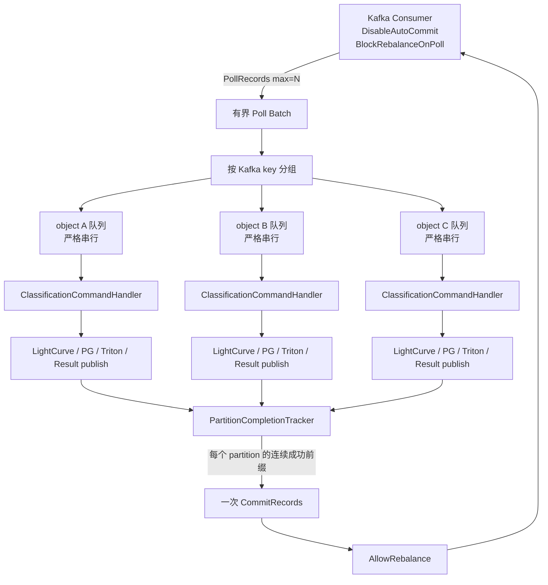
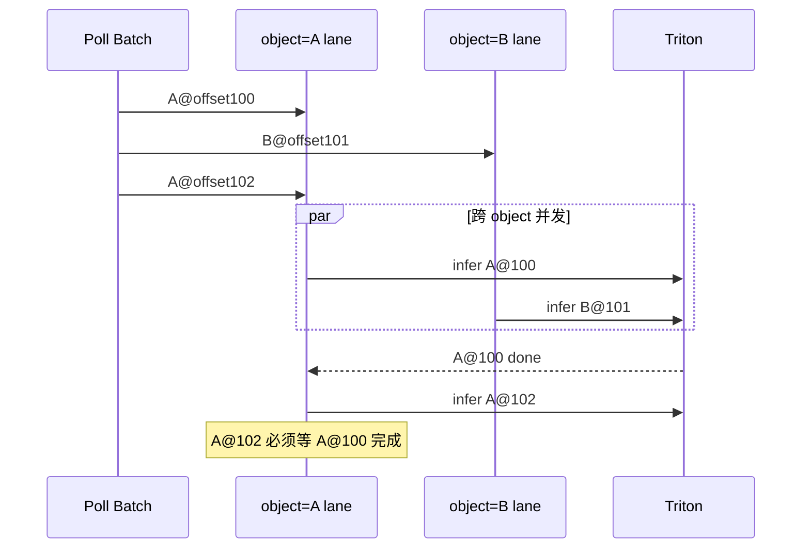
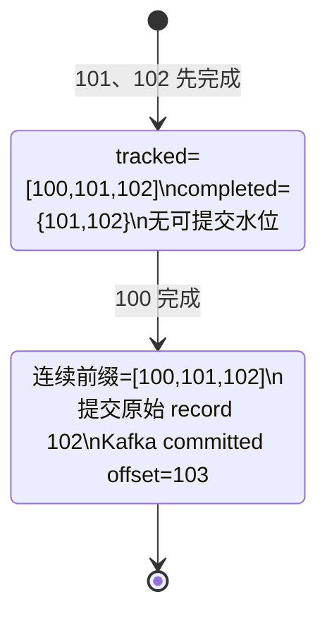
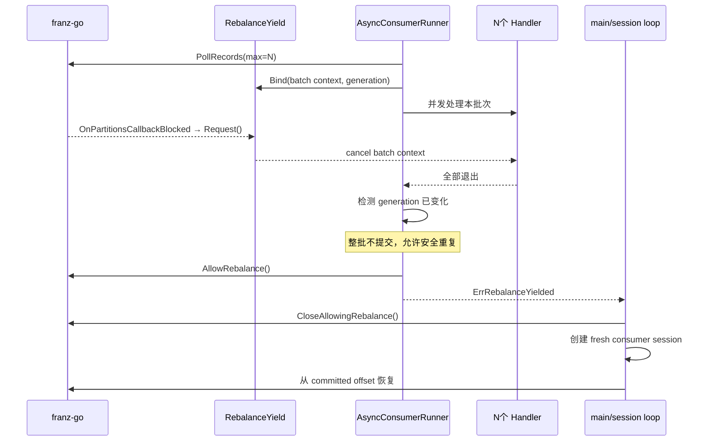
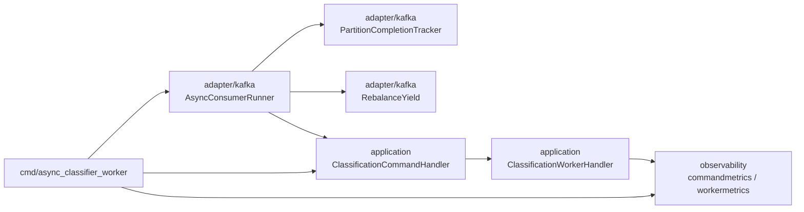

# Classifier Worker 并发改造：实现、正确性与面试讲解

> 状态说明：本文描述的是本次已经落到代码并通过单元测试的第一版并发方案。吞吐提升幅度尚未经过真实 Kafka、LightCurve、PostgreSQL、Triton 联合压测，因此本文不声称 QPS 已从 33/s 提升到某个具体数值。

## 1. 一句话结论

串行版的瓶颈不是 Kafka 只能逐条处理，而是一个 Worker 只有一个 in-flight command：LightCurve、PostgreSQL、Triton 和 Kafka ACK 的等待时间全部串在一起。

本次改造把它变为：

- 每次最多 poll `N` 条，形成天然有界的批次；
- 相同 Kafka key（当前约定为 `object_id`）仍按 poll 顺序串行；
- 不同 key 并发执行完整的 Retry → Worker → Result/DLQ 发布链；
- record 可以乱序完成，但每个 partition 只提交连续成功前缀；
- blocked rebalance 到来时取消整批、放行 rebalance、销毁旧 consumer session，再从 committed offset 恢复；
- 第一版仍保留单对象 Triton 请求和 Kafka `ProduceSync`，先单独验证 Worker concurrency 的收益。

配置项：

```bash
CLASSIFIER_WORKER_CONCURRENCY=8
```

允许范围为 `1..64`，默认 `1`。默认值为 1 是为了能用同一份并发代码复现串行基线，然后按 `1/2/4/8/16` 逐级压测。

## 2. 为什么原链路有 33/s 左右的天花板

原 Worker 的关键路径是：


如果单条端到端平均耗时约为 30 ms，那么单进程完全串行时的理论吞吐就是：

```text
1 / 0.030 ≈ 33 events/s
```

这时即使 Triton 或 GPU 还有容量，Worker 也不会在等待请求 A 时发出请求 B。CPU、网络、PG、Triton 和 Kafka 的等待时间无法相互覆盖。

## 3. 本次采用的第一版架构



这里的“批次”不是模型 batch，也不是 Triton dynamic batching。它只是 Kafka consumer 一次 poll 得到的有界 record 集合。每条 command 仍然独立调用一次 Triton。

### 3.1 为什么选择“批次波次”而不是持续后台 poll

持续 poll + 全局 in-flight 队列理论上可以减少批次尾部的 straggler barrier，但它会立刻引入更多生命周期问题：

- record 属于哪一代 consumer ownership；
- partition revoke 时哪些任务必须取消；
- 后台 commit 是否可能发生在 `AllowRebalance` 之后；
- completion channel 关闭、丢事件或 goroutine 泄漏如何处理；
- shutdown 时应该排空到什么边界；
- per-key scheduler 如何跨多个 poll window 保序。

第一版先让一个批次完整处于同一个 `BlockRebalanceOnPoll` 窗口内：处理、计算水位、提交，然后才 `AllowRebalance`。它牺牲了一部分极限吞吐，但显著缩小了正确性状态空间，适合作为后续优化的可验证基线。

## 4. 同 key 串行、跨 key 并行

Kafka 只保证 partition 内的读取顺序，不会替应用程序自动保证并发执行的完成顺序。

本项目的 Kafka key 是 `object_id`。同一目标的新 revision 与旧 revision 如果并行，虽然数据库的 Current 条件推进可以吸收一部分乱序，但仍会让 Result topic 的观察顺序、依赖调用和故障分析变复杂。因此第一版保留 per-object serialization。



如果 record 没有 key，代码会退化为“同 partition 串行”。因为缺少 object identity 时，这是应用还能保留的最强顺序保证。

## 5. Offset 正确性：执行可乱序，提交只能推进连续前缀

假设 partition 0 poll 到：

```text
offset 100  RUNNING
offset 101  SUCCESS
offset 102  SUCCESS
```

此时不能提交 record 102。`CommitRecords(record102)` 的语义是下一次从 103 开始读取，它会把仍未完成的 100 一起越过去。



本次 `PartitionCompletionTracker` 的关键点有两个。

### 5.1 按实际 poll 顺序跟踪，不假设 offset 数字连续

不能简单写成：

```go
for completed[nextOffset] {
    nextOffset++
}
```

因为 compacted 或 transactional Kafka log 可能出现实际可见 record 为：

```text
100, 105, 109
```

数值 101 并不一定是“尚未完成”，它可能根本不会被当前 consumer 读到。

新版 tracker 会先注册本批次实际 poll 到的 partition 顺序，再沿这条有序队列推进。只要 100、105、109 都完成，就可以安全提交原始 record 109。

### 5.2 提交原始 record，避免 offset 多加 1

franz-go 的 `CommitRecords` 接收“已经处理完成的 record”，内部提交的是该 record 的 `Offset + 1`。

因此 tracker 返回最高连续完成的实际 record offset，runner 找回对应的原始 `*kgo.Record` 并提交。不能自己构造 `Offset=nextCommitOffset` 再交给 `CommitRecords`，否则很容易再次被库加 1，形成 off-by-one 丢消息风险。

## 6. 成功、失败、Retry、DLQ 的语义

并发边界包住的是完整的 `ClassificationCommandHandler`，而不只是 Triton 调用：

```text
ClassificationCommandHandler
└── Command DLQ
    └── long RETRYABLE
        └── ClassificationWorker
            ├── fixed LightCurveRevision
            ├── PG compatible coarse query
            ├── Triton
            └── Result ProduceSync
```

不同返回路径的含义如下：

| Handler 结果 | 业务含义 | completion tracker | 是否可能提交原 command |
|---|---|---|---|
| Result publish 成功，返回 `nil` | 分类结果已被 Kafka 确认 | 标记完成 | 连续前缀内可以提交 |
| PERMANENT，DLQ publish 成功后返回 `nil` | 原始坏消息已被可靠转移 | 标记完成 | 连续前缀内可以提交 |
| RETRYABLE | 在该 record 的 handler 内持续退避重试 | 不标记完成 | 成功或 rebalance yield 前不提交 |
| DLQ publish 失败或意外错误 | 副作用没有达到成功边界 | 不标记完成 | 不跨过该缺口 |
| Context cancelled | 当前 ownership/shutdown 结束 | 不标记完成 | 不跨过该缺口 |

发生非预期 handler error 时，runner 会取消同批其他 key 的处理，收集已经确定成功的 completion，只提交错误之前的安全连续前缀，然后返回错误。已经成功发布但未能提交的消息允许在重启后重复执行，由现有 deterministic ID 与数据库幂等规则吸收。

## 7. Rebalance 如何与并发批次协调

现有串行版已经证明一个重要事实：只是不 commit 当前 record，并不代表旧 consumer session 的下一次 poll 会回到它；旧 session 的 fetch position 可能已经前进。因此并发版继续保留 fresh session 方案。



这里选择“yield 发生后整批不提交”，即使批次里有部分 record 已成功。它会增加少量重复，但避免在 pending rebalance 边界上继续做 group commit，语义更保守、更容易证明。

## 8. 代码模块组织



### 8.1 `cmd/async_classifier_worker`

Composition root，负责：

- 读取 `CLASSIFIER_WORKER_CONCURRENCY`；
- 创建原有 LightCurve、PG、Triton、Kafka publisher 依赖；
- 组装 Retry/DLQ/Worker handler；
- 创建带 `DisableAutoCommit`、`BlockRebalanceOnPoll` 的 Kafka client；
- 把并发度交给 `AsyncConsumerRunner`；
- yield 后关闭旧 client 并创建 fresh session。

### 8.2 `internal/adapter/kafka/async_consumer.go`

负责 Kafka ownership 范围内的并发编排：

- `PollRecords(ctx, concurrency)`；
- 按 key 建立顺序队列；
- 每个 key 一个批次内执行 lane；
- 收集 completion；
- 计算各 partition 可提交前缀；
- 一次 `CommitRecords` 合并多个 partition 水位；
- commit 后才 `AllowRebalance`。

### 8.3 `partition_completion_tracker.go`

这是一个批次内纯状态机，不调用 Kafka、不启动 goroutine：

- `Track` 注册实际读取顺序；
- `MarkCompleted` 记录乱序完成；
- 只有队头连续完成时才推进；
- 返回最高可提交的实际 record offset。

由于 tracker 只由 runner 的 completion 汇总协程访问，所以它不需要 mutex。并发 handler 只往 buffered completion channel 写结果。

### 8.4 Application 层

Application handler 不知道 Kafka 如何并发，也不知道 completion tracker。它只维持原有成功边界：

```text
Result 或 DLQ 被 Kafka 确认
→ Handle 返回 nil
```

因此 Kafka offset correctness 与业务流程仍通过 `MessageHandler` 接口解耦。

## 9. 对原新增代码的批判性审查

原思路抓住了“乱序执行 + 连续水位提交”的核心，但实现把第一版拆成了过多异步层。下面是本次收敛理由。

| 原组件/做法 | 问题 | 本次处理 |
|---|---|---|
| `ClassificationWorkerPool.Handle` | `Handle` 提交后仍同步等 done；外层串行 consumer 不变时，并不会产生多个 in-flight | 删除；并发边界移到 Kafka runner，并发执行完整 handler |
| `AsyncRecordProcessor` | 与 application worker pool 形成双重线程池，但 `Process` 自身仍同步等待；职责重复 | 删除 |
| callback 式 `AsyncRecordDispatcher` | Context cancel 时 completion 可能被丢弃，in-flight token 可能无法归还；关闭顺序复杂 | 删除；一个 poll batch 内用 buffered completion channel + WaitGroup 汇总 |
| `AsyncConsumerRunner` 持续 poll + completion goroutine | dispatcher、coordinator、manager 任一后台错误都需要跨 goroutine 传播；session/shutdown/rebalance 生命周期不清晰 | 改为一个批次内同步完成 ownership 状态机 |
| tracker 外部 `InitializePartition` | composition root 必须猜初始 offset，漏初始化就运行时报错 | `Track` 从真实 fetch record 自动建立批次状态 |
| `nextCommitOffset++` | 假设 offset 数字连续，遇到实际 offset 空洞会卡住 | 按实际 fetched offset 队列推进 |
| coordinator 构造 `Offset=nextOffset` 后调用 `CommitRecords` | franz-go 还会提交 `record.Offset+1`，存在多加 1 风险 | 提交最高连续完成的原始 record |
| completion error 直接忽略 | 失败 offset 会形成永久缺口，但 runner 仍可能继续 poll，状态和内存持续增长 | 取消本批其他任务、提交安全前缀、返回错误或 yield fresh session |
| 后台 `CommitManager` 定时 flush | commit 可能跨过 `AllowRebalance` 或 consumer ownership 边界；flush error 曾被吞掉；stop/context 双生命周期复杂 | 删除；每个有界 batch 最多一次同步 commit |
| `CommitBatcher` | 在批次波次模型里 runner 本身已经只保留每 partition 一个水位，形成重复抽象 | 合并进 runner |
| 单一 retrying bool | 两条并发 command 同时 retry 时，一条结束会把另一条的指标错误清零 | 改为并发计数 |

复杂度不是越少越好，而是每一层都应对应一个当前确实存在、无法由相邻层安全承担的生命周期。第一版只保留 runner、tracker 和现有 yield 三个 Kafka 并发核心。

## 10. 可观测性

新增/修正指标：

```text
astro_classification_worker_concurrency
astro_classification_command_inflight
astro_classification_command_processing_duration_seconds
astro_classification_command_stage_duration_seconds{stage="..."}
astro_classification_command_retrying
```

固定 stage：

```text
decode
prepare_input
resolve_bundle
triton
build_run
build_result
result_publish
```

`prepare_input` 当前包含 fixed LightCurve 读取、输入校验和 compatible coarse query。LightCurve HTTP 与 PG 自身已有 adapter metrics，因此定位时应联合看：

```text
worker prepare_input
+ LightCurve HTTP duration
+ PG query/pool metrics
```

指标 label 只有固定 stage，不放 `object_id/job_id/offset/error`，避免高基数。

## 11. 如何运行与验证

本地编译：

```bash
go build ./cmd/async_classifier_worker
```

在串行 Worker 原有环境变量基础上增加：

```bash
CLASSIFIER_WORKER_CONCURRENCY=8
```

建议先保持：

```text
Triton max_batch_size = 0
Kafka publisher = ProduceSync
Worker Pod 数量不变
测试数据分布不变
```

逐级测试：

| concurrency | 吞吐 | command P95 | Triton P95 | Triton queue | GPU util | Kafka lag | error/DLQ |
|---:|---:|---:|---:|---:|---:|---:|---:|
| 1 | 待测 | 待测 | 待测 | 待测 | 待测 | 待测 | 待测 |
| 2 | 待测 | 待测 | 待测 | 待测 | 待测 | 待测 | 待测 |
| 4 | 待测 | 待测 | 待测 | 待测 | 待测 | 待测 | 待测 |
| 8 | 待测 | 待测 | 待测 | 待测 | 待测 | 待测 | 待测 |
| 16 | 待测 | 待测 | 待测 | 待测 | 待测 | 待测 | 待测 |

停止增加并发度的信号：

- throughput 基本不再上升；
- P95/P99 明显恶化；
- Triton queue/pending 持续上升；
- LightCurve/PG/Kafka 出现限流或连接池等待；
- GPU 已稳定饱和；
- retry、DLQ 或 Kafka lag 异常增加。

## 12. 已完成测试覆盖

代码级测试覆盖了：

- 不同 key 同时进入 handler；
- 相同 key 必须按 poll 顺序处理；
- offset 102 先完成时不能越过 101 的失败缺口；
- tracker 支持 `100,105,109` 这类数字不连续的实际 record；
- 多 partition 状态隔离；
- rebalance yield 取消整批且该批零提交；
- poll 上限等于配置 concurrency；
- concurrency 配置默认值、合法值和 `1..64` 边界；
- 并发 retry metric 不会被单个 command 结束错误清零；
- 固定 stage duration metric。

仍需要真实环境补证据：

- Kafka 三 broker + 两 consumer rebalance；
- Triton outage 期间多条 RETRYABLE 同时存在；
- kill -9 后从 committed prefix 恢复；
- DLQ publish failure 不跨 offset；
- concurrency `1/2/4/8/16` 的联合压测；
- 长时间 soak 与 goroutine/memory 稳态；
- hot key/hot partition 数据分布下的公平性。

## 13. 第一版的明确局限与后续路线

### 13.1 批次尾部屏障

下一次 poll 必须等待本批最慢 key。某条命令较慢时，同批其他 key 即使已完成，也不会立刻补入新任务。这是第一版为了把 ownership 限定在一个 poll window 内主动接受的权衡。

只有在真实压测证明该屏障成为主要瓶颈后，才考虑第二版持续 dispatcher。第二版必须同时引入 partition revoke drain/cancel、generation ownership、跨 poll per-key scheduler 和同步 commit loop，不能只加 goroutine。

### 13.2 单个 hot key 仍然串行

如果绝大多数消息都属于同一个 object，per-key serialization 会让有效并发下降。这是正确性/顺序与吞吐的显式权衡。应先用 key 分布指标和压测确认，而不是默认取消同对象顺序。

### 13.3 还没有 Triton batching

当前只是 concurrent single-object requests。正确顺序是：

```text
Worker concurrency 基线
→ 找到下一个瓶颈
→ Triton instance/concurrency tuning
→ 再评估 length bucket + padding/mask + dynamic batching
→ 最后做 Pod/GPU 水平扩容容量模型
```

## 14. 面试时怎么讲

### 14.1 90 秒版本

> 我在压测里发现 classifier-worker 的稳定吞吐大约 33/s，和单条链路约几十毫秒的延迟非常接近。根因不是 Kafka 只能串行，而是 Worker 每次只 poll 一条，必须等 LightCurve、PG、Triton 和 Kafka Result ACK 全部完成并 commit 后才处理下一条，整个进程只有一个 in-flight request。
>
> 我把它改造成有界并发 consumer：每次最多 poll N 条，按 object_id 这个 Kafka key 建 lane，同对象仍按顺序，不同对象并发执行完整的 retry、推理和结果发布链。最大的难点是 offset 不能按完成顺序提交。我实现了 partition completion tracker，先登记实际 poll 到的 offset 顺序，允许任务乱序完成，但只推进连续成功前缀；提交时传最高连续完成的原始 record，避免 franz-go `CommitRecords` 再加 1 的 off-by-one。
>
> Rebalance 方面我复用了原来的 yield/fresh-session 机制，但把取消单位扩展成整个 poll batch。blocked rebalance 到来时取消所有 in-flight handler，整批不提交，AllowRebalance 后关闭旧 consumer session，再从 committed offset 恢复。这样保留 at-least-once，重复由 deterministic job/run ID 和数据库幂等吸收。
>
> 我还删除了双重 worker pool 和后台 commit manager，因为第一版里它们让 goroutine、shutdown 和 partition ownership 交叉，却没有带来额外吞吐。现在先用 concurrency 1/2/4/8/16 压测找到拐点，再决定是否做 Triton dynamic batching，而不是一开始同时改 Worker 和模型协议。

### 14.2 可以强调的工程判断

1. 优化前先用 `1 / latency` 验证吞吐天花板来源。
2. 并发的核心不是“开 goroutine”，而是把 execution order 与 commit order 解耦。
3. Kafka offset 可能有数字空洞，连续性的定义应基于实际 fetched record 顺序。
4. `CommitRecords` 提交的是输入 record 的下一位，必须警惕 off-by-one。
5. Rebalance 是 partition ownership 变化，不只是 context cancel。
6. 第一版主动选择批次屏障，用较小状态空间换取可证明性，再由压测决定是否升级。
7. 性能结果没有测出来前，不把设计目标写成已实现提升。

## 15. 高频追问与回答

### Q1：为什么不直接 `go handler(record)`？

因为 goroutine 只解决执行并发，不解决 offset、同对象顺序、背压、rebalance ownership、shutdown 和错误传播。直接 goroutine 后如果 101/102 先完成就提交 103，100 可能在崩溃后永久丢失。

### Q2：为什么是 at-least-once，不是 exactly-once？

Result Kafka publish 和 Command offset commit 是两个独立副作用，没有放在一个 Kafka transaction 中。publish 成功后进程可能在 commit 前崩溃，消息会重放。因此系统明确接受物理重复，用 deterministic identity、数据库 UNIQUE/PK 和 Current 条件推进做逻辑幂等。

### Q3：为什么同一个 object 不并发？

同 object 的 revision 有业务演进关系。虽然 Current 条件更新能防止旧 revision 覆盖新 revision，但保持同 key 顺序能降低 Result 乱序、重复推理和排障复杂度。跨 object 并发已经能覆盖主要 IO/GPU 等待。

### Q4：为什么 tracker 不用 mutex？

handler goroutine 不直接修改 tracker，只向 buffered completion channel 写结果。runner 的单个汇总协程串行调用 `MarkCompleted`，所以 tracker 是单 owner 状态机。用 ownership 避免共享写，比到处加锁更容易验证。

### Q5：Kafka offset 不是天然连续的吗？

log 中有 offset 序号，但 consumer 可见的 record 不一定逐整数连续，例如 compaction、事务过滤或控制记录都可能产生空洞。因此安全连续前缀应该基于本批实际 poll 到的 partition record 顺序。

### Q6：为什么不异步 commit？

当前每个 poll batch 已经合并为每 partition 一个水位，一次同步 `CommitRecords` 的频率远低于逐条 commit。异步 commit 会把回调生命周期带到 `AllowRebalance` 之后，第一版收益不明确但 ownership 风险明显，所以先不做。

### Q7：某条失败时为什么还能提交前面的成功前缀？

前缀内每条 record 的 Result 或 DLQ 都已被 Kafka 确认，提交它们不会越过失败缺口。失败 record 及其后续未形成连续前缀的 record 会在恢复后重放，符合 at-least-once。

### Q8：rebalance 时为什么整批都不提交？

这是保守策略。blocked rebalance 已经说明 ownership 正在变化，继续做 group commit 会增加时序组合。整批重放只增加可被幂等吸收的重复，却让规则非常清楚：yield generation 变化的批次没有 commit。

### Q9：并发度为什么限制到 64？

防止错误配置瞬间放大 HTTP 连接、PG pool 等待、Triton pending 和 Kafka producer buffer。真实 sweet spot 应由 `1/2/4/8/16` 压测决定，64 只是配置护栏，不是推荐值。

### Q10：如何判断下一个瓶颈是 Triton？

提高 Worker concurrency 时，如果 command throughput 不再增加，同时 Triton queue/pending 和 GPU utilization 上升，就说明推理侧趋于饱和。如果 Triton 不忙而 `prepare_input`、LightCurve HTTP 或 PG pool wait 上升，则瓶颈在输入侧。

### Q11：为什么暂时不做 dynamic batching？

它会改变 serving contract，涉及 batch dimension、变长序列 bucket、padding/mask、Python backend 向量化和延迟窗口。如果和 Worker concurrency 同时改，无法归因收益和回归。先测 concurrent single-object requests 能得到更干净的容量曲线。

### Q12：这一版最可能的性能缺点是什么？

批次尾部屏障。一个慢 key 会延迟下一次 poll。真实数据如果 service time 方差很大，第二版可以做持续有界 dispatcher，但必须把 generation ownership、partition revoke、跨 poll per-key queue 和同步 commit loop一起设计，而不是只取消 barrier。

## 16. 简历表述边界

在真实 benchmark 完成前，建议写：

> 设计并实现 classifier-worker 有界并发处理，按 object key 保序、跨 object 并行，并通过 partition completion tracker 仅提交连续成功 offset；将 rebalance-yield 扩展到批次取消与 fresh-session 恢复，补充乱序完成、offset 空洞和并发 retry 指标测试。

完成真实压测后，才把实际测得的 `concurrency → throughput/P95/GPU utilization` 数字补进简历。不要提前写“吞吐提升 X 倍”。
