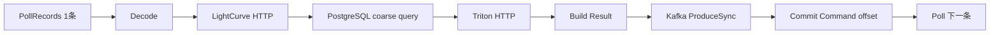
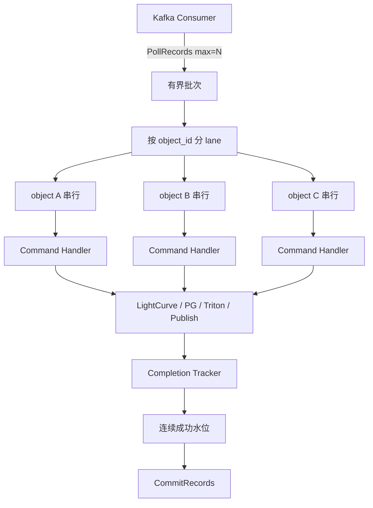
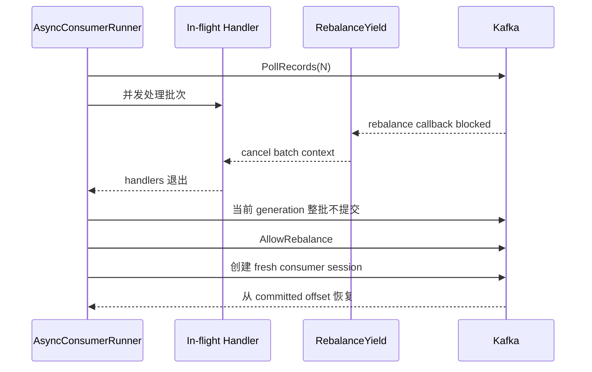
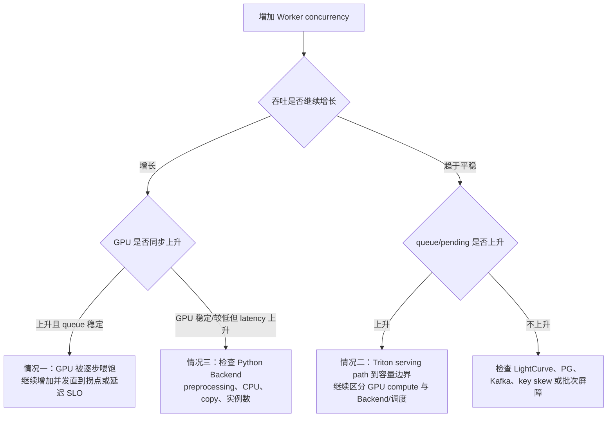

# 阶段 S10 工作总结

> 主题：Classifier Worker 有界并发改造与 Triton 吞吐瓶颈定位
> 状态：并发实现、镜像发布、Kubernetes 实验部署、可观测性和第一轮服务器阶梯压测已经完成；最终推荐并发度仍需同负载对照和故障/Soak 验收。

## 1. 阶段结论

原串行 `classifier-worker` 每个进程只有一个 in-flight Command，必须依次等待 LightCurve HTTP、PostgreSQL 查询、Triton 推理、Kafka Result ACK 和 offset commit。单条请求中的 IO 与推理等待无法重叠，所以吞吐近似受限于：

```text
单 Worker 吞吐 ≈ 1 / 单条 Command 端到端延迟
```

原串行版本在约 `57 events/s` 输入下会出现 ClassificationCommand 积压。本阶段在不破坏 Kafka at-least-once、Retry、DLQ、Rebalance 和 Result publish 成功边界的前提下，把 Worker 改造成有界并发：

- 每次最多 poll `N` 条 Command；
- 相同 `object_id` 串行，不同对象并行；
- record 可以乱序完成，offset 只能提交每个 partition 的连续成功前缀；
- Result 或 DLQ 被 Kafka 确认后，原 Command 才能完成；
- Rebalance 时取消批次、整批不提交、放行 rebalance，并从 committed offset 创建 fresh session；
- 并发度通过 `CLASSIFIER_WORKER_CONCURRENCY` 配置，范围为 `1..64`。

两个 Worker Pod 的第一轮服务器数据为：

| 每 Pod concurrency | Offered rate | Processing rate | Triton request | Triton queue | Pending | GPU util | 判断 |
| ---: | ---: | ---: | ---: | ---: | ---: | ---: | --- |
| 1 | 53/s | 46/s | 24 ms | 0.4 ms | 1 | 2% | 输入高于处理能力 |
| 2 | 67/s | 67/s | 25 ms | 0.8 ms | 1 | 4% | 当前负载下能跟上 |
| 4 | 100/s | 100/s | 30 ms | 1.8 ms | 2 | 5% | 当前负载下能跟上 |
| 8 | 150/s | 150/s | 40 ms | 11.3 ms | 4 | 7% | 能跟上，排队开始增加 |
| 16 | 200/s | 165/s | 80 ms | 40 ms | 13 | 9% | 吞吐趋缓，排队明显 |

因此，原来的 Worker 串行瓶颈已被显著缓解：从约 `57/s` 出现积压，推进到当前数据分布下两个 Pod、`concurrency=8` 能跟上 `150/s`。提高到 `concurrency=16、rate=200/s` 后，处理速率约 `165/s`，Triton queue latency 和 pending request 明显上升，瓶颈开始从 Worker 调度迁移到 Triton serving path。

由于各轮 offered rate 不同，这是一组容量阶梯测试，不是严格的同负载 concurrency 对照。当前还不能把 `8` 或 `16` 宣布为最终 sweet spot，至少需要补充 `concurrency=8、rate=200/s`。

## 2. 原串行 Worker 为什么有吞吐天花板



串行链只有一个 in-flight request。即使 GPU 尚有余量，Worker 也必须等当前请求完成后才发送下一条。当输入速率 `λ` 高于服务速率 `μ` 时：

```text
λ > μ
↓
ClassificationCommand lag 持续增长
```

所以串行版在约 `57/s` 积压，只能证明应用服务能力不足，不能直接证明 Kafka 或 GPU 已经到达极限。

## 3. 本阶段完成的工作

### 3.1 关键路径可观测性

新增并接入：

```text
astro_classification_worker_concurrency
astro_classification_command_inflight
astro_classification_command_processing_duration_seconds
astro_classification_command_stage_duration_seconds{stage="..."}
```

固定阶段：

```text
decode
prepare_input
resolve_bundle
triton
build_run
build_result
result_publish
```

这使性能问题可以从“整体慢”继续拆到输入准备、Triton 和 Result publish。

### 3.2 并发版 Worker 入口

新增：

```text
cmd/async-classifier-worker
```

候选入口复用原有 Command decode、LightCurve、PG、Triton、Result、Retry、DLQ、Kafka SASL、serving manifest 和 management endpoint，只替换 record 执行与 offset 提交编排，避免同时改变业务合同和模型协议。

### 3.3 同 key 保序、跨 key 并行



同一对象的 revision 不并发，降低 Result 乱序和重复推理的复杂度；不同对象并行，用于覆盖 HTTP、PG、Triton 和 Kafka ACK 的等待。

### 3.4 连续 offset 水位

如果同一 partition 出现：

```text
offset 100  RUNNING
offset 101  SUCCESS
offset 102  SUCCESS
```

不能提交 record 102，否则 Kafka 会认为 `<103` 全部完成，崩溃后 offset 100 可能永久丢失。

`PartitionCompletionTracker`：

- 按实际 fetched record 顺序跟踪，而不是假设 offset 数字连续；
- 允许 completion 乱序到达；
- 只推进连续成功前缀；
- 返回最高连续完成的原始 record；
- 避免 franz-go `CommitRecords` 再次 `Offset+1` 导致 off-by-one。

### 3.5 Rebalance 与 at-least-once



Result publish 与 Command commit 是两个独立副作用，因此系统明确保持 at-least-once。publish 成功、commit 前崩溃时允许重复，由 deterministic job/run ID 和 PostgreSQL 幂等保存吸收。

### 3.6 批判性收敛原设计

最初方案同时引入 application worker pool、async processor、dispatcher、commit coordinator、batcher 和后台 commit manager。组合后形成双重线程池以及跨 goroutine 的 completion、shutdown、rebalance 和 commit 生命周期。

最终收敛为：

```text
AsyncConsumerRunner
+ PartitionCompletionTracker
+ RebalanceYield/fresh session
```

第一版采用批次波次模型，用有限的极限吞吐换取更小、可测试、可证明的状态空间。只有真实压测证明批次尾部屏障成为主要瓶颈时，才升级为持续 dispatcher。

### 3.7 发布、部署和 Dashboard

已完成：

- GitHub Actions 发布 `async-classifier-worker`；
- 服务器使用不可变 image digest 实验部署；
- 两个 Kubernetes Worker Pod；
- ConfigMap concurrency 配置；
- PodMonitor 抓取 `management:9091/metrics`；
- Grafana 增加 concurrency、in-flight、处理速率、总耗时和阶段耗时；
- `1/2/4/8/16` 阶梯压测和绝对时间窗口记录。

## 4. 如何正确解释第一轮结果

正确的容量表述是：

```text
concurrency=1  容量约 46/s
concurrency=2  容量至少 67/s
concurrency=4  容量至少 100/s
concurrency=8  容量至少 150/s
concurrency=16 在 offered=200/s 时处理约 165/s
```

不能把 `67/100/150` 直接当作 `2/4/8` 的最大吞吐，因为这些轮次的处理速率等于 offered rate，Worker 可能仍有余量。

第一轮还暴露了指标解释问题：

- Kafka consume rate 不是 committed lag；
- Grafana `lastNotNull` 不是窗口最大 in-flight；
- Retry rate 不是 Retry 增量，应查询 `increase()`；
- Histogram bucket 边界不是精确平均延迟；
- 平均值应使用 `increase(sum)/increase(count)`；
- 对照实验必须使用相同负载和绝对时间窗口。

性能工程不仅是写并发代码，也包括设计可归因、可复现、不会误读的实验。

## 5. Triton 新瓶颈的三种情况



### 情况一：GPU utilization 上升，吞吐继续增长

说明新增并发正在提高 GPU occupancy，可以继续增加并发，直到 throughput 增幅下降、P95 超标、queue/pending 增长或 GPU 稳定饱和。

### 情况二：queue latency 和 pending 上升

说明 Triton serving path 的到达速率接近或超过服务速率，但不能仅凭排队断言 GPU 算力饱和：

```text
GPU 高 + compute latency 上升
→ 更像 GPU compute 瓶颈

GPU 低 + compute 稳定 + queue/pending 上升
→ 更像模型实例、Python Backend、CPU preprocessing、BLS/调度或 copy 瓶颈
```

### 情况三：GPU 稳定或较低，但 request latency 高

优先排查：

- Python Backend 单样本 for-loop；
- NumPy 特征计算与内存复制；
- XGBoost feature extraction；
- padding/mask 和 dtype/shape 转换；
- Python/model instance 数不足；
- Backend 之间的 BLS 调用；
- HTTP/JSON 编解码；
- CPU、GIL 或内存带宽。

### 当前判断

从 `concurrency=8` 提升到 `16` 时：

```text
throughput       至少150/s → 约165/s
request latency  40 ms → 80 ms
queue latency    11.3 ms → 40 ms
pending          4 → 13
GPU utilization  7% → 9%
```

当前更像情况二和情况三的组合：Triton serving path 已经排队，但 GPU utilization 仍低。证据更支持模型实例、Python Backend、preprocessing 或调度开始成为限制，尚不能证明原始 GPU compute 已经饱和。

## 6. 下一步优化路线

### P0：补同负载证据

补测：

```text
两个 Worker Pod
concurrency=8
rate=200/s
150秒
```

与 `concurrency=16、rate=200/s` 对照。如果两者都约 `165/s`，优先选择 latency/queue 更低的 `8`。

同时补齐 Kafka committed lag、Retry/DLQ window increase、Triton request/queue/compute、GPU utilization/memory。

### P1：隔离 Triton

保持 `max_batch_size=0` 和 serving contract 不变，使用 direct Triton/perf analyzer 测：

```text
concurrency = 1/2/4/8/16/32
```

对比 Worker→Gateway→Triton 与 direct Triton，定位瓶颈是在外围链路、Triton scheduler、Python Backend 还是模型 compute。

### P2：调整 Triton instance

一次只改变一个变量，测试：

- top-level Python model `instance_group`；
- GPU model instance count；
- Python Backend CPU instance count；
- Gateway/Triton 连接复用。

### P3：优化 preprocessing

- profile Python 特征提取和数据转换；
- 向量化 NumPy 计算；
- 减少 host memory copy；
- 批量生成 `[B,57]` XGBoost 特征；
- 合并重复 BLS；
- 将 CPU 密集 preprocessing 与 GPU model 解耦。

### P4：Dynamic Batching v2

在单对象并发极限明确后，再引入：

```text
length bucket + padding + mask + batch dimension
preferred_batch_size + max_queue_delay
```

测试 batch `1/2/4/8/16/32` 的 throughput/latency。Transformer、feature extraction 和 XGBoost 都应尽量批量执行，不能只让 Triton 收集 batch，Python 内部仍逐样本循环。

### P5：最后再做异步 publish 和水平扩容

只有阶段指标证明 `result_publish` 成为瓶颈时，才评估 async produce + delivery callback。先获得单 Worker Pod 和单 Triton replica 的 sweet spot，再根据总到达速率和容量余量确定 Pod/replica 数量。

## 7. 本阶段的主要难点

1. 并发不只是增加 goroutine，还要同时处理 offset、顺序、背压、Retry、DLQ、Rebalance、shutdown 和 error propagation。
2. 执行可以乱序，commit 只能推进连续成功前缀。
3. Kafka 可见 offset 不一定逐整数连续，franz-go `CommitRecords` 还包含 `Offset+1` 语义。
4. Rebalance 是 partition ownership 变化，不只是 context cancel；旧 session 必须退出。
5. publish 与 commit 不是同一事务，只能通过 at-least-once + 业务幂等吸收重复。
6. 需要在极限吞吐和可证明状态空间之间做取舍。
7. 性能指标容易误读，实验设计必须区分 rate、increment、lag、last、max 和 histogram quantile。
8. 优化一个瓶颈后，新瓶颈会迁移，不能继续沿用原来的性能假设。

## 8. 可复用的方法论

### 8.1 Correctness first

先冻结成功边界、offset、Retry、DLQ、Rebalance 和崩溃恢复，再提高并发。性能优化不能以可能丢消息为代价。

### 8.2 先画关键路径，再做简单容量模型

列出：

```text
Decode → LightCurve/PG → Triton → Result publish → Commit
```

用 `1 / latency` 验证串行吞吐数量级，再决定并发边界。

### 8.3 为并发写出不变量

```text
最大 in-flight 有界
同 key 保序
不同 key 并行
Result/DLQ ACK 后才完成
commit 不跨失败缺口
rebalance generation 变化后不 commit
允许重复，不允许丢失
```

实现和测试围绕不变量，而不是围绕线程数量。

### 8.4 一次只改变一个主要变量

本阶段保持模型、Triton contract、`max_batch_size=0` 和 `ProduceSync` 不变，只改变 Worker concurrency，使收益可以归因。

### 8.5 用阶梯压测找拐点

最佳并发度不是数字最大，而是边际吞吐收益开始下降、latency/queue 仍可接受的位置。

### 8.6 端到端定位，组件级隔离

```text
E2E：系统最终能处理多少
Component benchmark：具体组件为什么慢、极限在哪里
```

先用 E2E 发现瓶颈迁移，再隔离 Triton 验证推断。

### 8.7 接受瓶颈迁移

```text
测量
→ 找到当前瓶颈
→ 做最小可归因改动
→ 重新测量
→ 观察瓶颈迁移
→ 进入下一轮
```

Worker 优化后 Triton 开始排队，不是优化失败，而是原瓶颈已经被移除。

### 8.8 证据必须附带边界

记录 Pod 数、每 Pod concurrency、offered rate、时间窗口、key/partition 分布、Triton 配置、throughput、latency、lag、retry、DLQ 和 restart。

当前 mock 只有有限固定 `object_id`，同 key 又必须串行，所以结论只代表当前数据分布，不能直接外推到全部真实望远镜流量。

## 9. 阶段状态

### 已完成

- Worker critical-path metrics；
- 并发入口、镜像和实验部署；
- 有界 poll batch；
- per-object serialization；
- partition contiguous completion tracker；
- Retry/DLQ/Result 成功边界复用；
- rebalance-yield/fresh session；
- Grafana Dashboard；
- 两 Pod `1/2/4/8/16` 第一轮阶梯压测。

### 待完成

- `concurrency=8、rate=200/s` 同负载对照；
- authoritative committed lag；
- direct Triton benchmark；
- Python Backend/preprocessing profiling；
- Triton instance 调优；
- Dynamic Batching；
- 长时间 soak；
- hot key/hot partition 公平性；
- 并发环境 kill/rebalance/dependency failure 验收。

## 10. 总结

S10 不是简单给 Worker 增加线程池，而是在保留 Kafka 正确性的前提下，把处理并发度与提交顺序解耦。它解决了串行 Worker 只有一个 in-flight request、在约 `57/s` 输入下出现 Command 积压的问题，并把当前两 Pod 的已验证容量下限推进到 `concurrency=8、150/s`。

`concurrency=16、rate=200/s` 时只能处理约 `165/s`，同时 Triton queue/pending 明显增长而 GPU utilization 仍低，说明下一阶段应该从 Worker 并发转向 Triton serving path、Python Backend 和 preprocessing 的隔离诊断，而不是继续盲目增加 Worker concurrency。

本阶段沉淀的方法是：

```text
先定义正确性不变量
→ 建立关键路径指标
→ 用简单模型解释瓶颈
→ 做有界、最小、可归因的改动
→ 阶梯压测寻找拐点
→ 联合 throughput/latency/queue/resource 判断瓶颈
→ 隔离组件验证推断
→ 接受瓶颈迁移并进入下一轮
```
